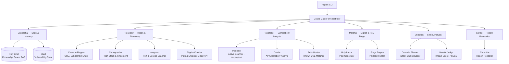
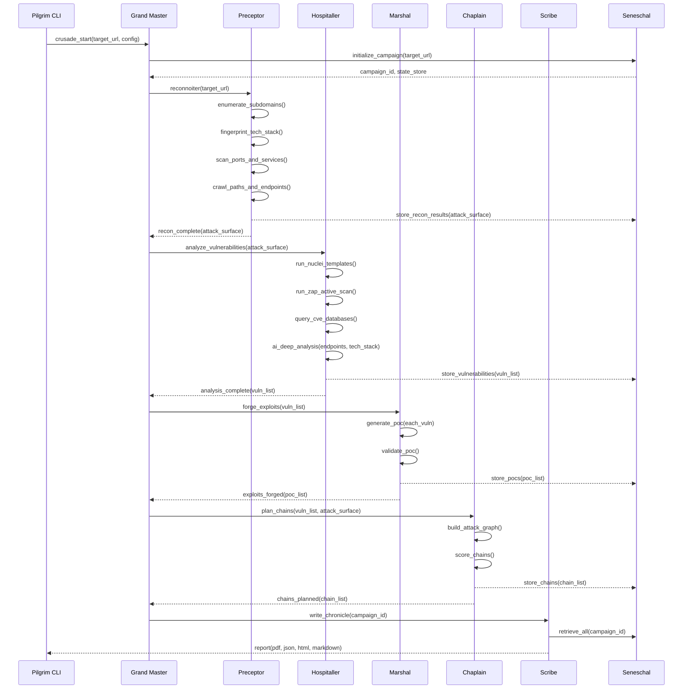

# Design Document: Templar — AI-Powered Cybersecurity Framework

## Overview

Templar is an autonomous, AI-driven cybersecurity framework that begins from a single URL and orchestrates a full offensive security lifecycle: discovery, fingerprinting, vulnerability scanning, exploit generation, vulnerability chaining, and comprehensive reporting. It combines the best open-source security tools (Nuclei, Subfinder, httpx, ffuf, OWASP ZAP, Nmap, etc.) with LLM reasoning (OpenAI, Anthropic, and others via user-provided API keys) across a hierarchy of specialized agents organized under Knights Templar naming conventions.

The framework is modular and extensible — each agent (Knight) operates as an independent unit, coordinated by the Grand Master orchestrator, and every component is hot-swappable or augmentable without touching peer modules. Templar supports both fully automated "Crusade" mode and interactive "Pilgrimage" mode where a human operator guides the campaign.

---

## Architecture

### System Overview




### Data Flow — Full Crusade Campaign




---

## Components and Interfaces

### Component: Grand Master (Orchestrator)

**Purpose**: Central orchestrator that drives the full campaign lifecycle. Manages agent scheduling, retries, error recovery, concurrency limits, and state transitions. Acts as the LLM "brain" for high-level decision-making — it reads intermediate results from Seneschal and decides what to do next.

**Interface**:
```typescript
interface IGrandMaster {
  startCrusade(config: CrusadeConfig): Promise<CampaignResult>
  pauseCrusade(campaignId: string): Promise<void>
  resumeCrusade(campaignId: string): Promise<void>
  abortCrusade(campaignId: string): Promise<void>
  getStatus(campaignId: string): CampaignStatus
  registerKnight(knight: IKnight): void
}
```

**Responsibilities**:
- Sequence agents in the correct order with dependency resolution
- Pass context between agents via Seneschal
- Retry failed subtasks with exponential backoff
- Enforce rate limits and scope constraints
- Make LLM-driven decisions on scan depth and agent prioritization

---

### Component: Seneschal (State & Memory)

**Purpose**: Persistent state store and campaign memory. Acts as the single source of truth for all agents. Supports RAG (retrieval-augmented generation) queries against the Holy Grail knowledge base for CVE and exploit intelligence.

**Interface**:
```typescript
interface ISeneschal {
  initializeCampaign(target: string, config: CrusadeConfig): CampaignState
  storeReconResults(campaignId: string, results: AttackSurface): void
  storeVulnerabilities(campaignId: string, vulns: Vulnerability[]): void
  storePOCs(campaignId: string, pocs: ProofOfConcept[]): void
  storeChains(campaignId: string, chains: AttackChain[]): void
  retrieve(campaignId: string, dataType: DataType): any
  queryKnowledgeBase(query: string): KBSearchResult[]
  exportCampaign(campaignId: string): CampaignExport
}
```

**Responsibilities**:
- Persist campaign state to disk / SQLite for resume-ability
- Vector-index CVE descriptions for semantic search (Holy Grail RAG)
- Provide typed access to all campaign artifacts
- Emit events for real-time CLI progress updates

---

### Component: Preceptor (Recon & Discovery Module)

**Purpose**: Full attack surface discovery. Orchestrates four sub-agents: Crusade Mapper (subdomain enum), Cartographer (tech stack), Vanguard (port scan), and Pilgrim Crawler (endpoint/path discovery).

**Interface**:
```typescript
interface IPreceptor extends IKnight {
  reconnoiter(target: string, options: ReconOptions): Promise<AttackSurface>
}

interface IReconSubAgent {
  execute(target: string, context: ReconContext): Promise<Partial<AttackSurface>>
}
```

**Sub-agents and their tools**:
- **Crusade Mapper**: Subfinder, Amass, crt.sh, DNSx — passive + active subdomain enumeration
- **Cartographer**: Wappalyzer fingerprints, httpx probe, HTTP header analysis, certificate inspection — tech stack detection across 7,200+ signatures
- **Vanguard**: Nmap NSE scripts, masscan for speed, service version detection
- **Pilgrim Crawler**: Gospider/Katana for JS-aware crawling, gau (GetAllURLs) for historical URLs, ffuf/feroxbuster for directory fuzzing, x8 for hidden parameter discovery

---

### Component: Hospitaller (Vulnerability Analysis Module)

**Purpose**: Multi-layered vulnerability detection combining deterministic template scanning with AI-driven semantic analysis.

**Interface**:
```typescript
interface IHospitaller extends IKnight {
  analyzeVulnerabilities(surface: AttackSurface): Promise<Vulnerability[]>
}

interface IVulnScanner {
  scan(targets: DiscoveredTarget[], context: ScanContext): Promise<RawFinding[]>
}

interface IVulnAnalyst {
  analyze(findings: RawFinding[], surface: AttackSurface): Promise<Vulnerability[]>
}
```

**Sub-agents and their tools**:
- **Inquisitor**: Nuclei (50,000+ community templates), OWASP ZAP active scan, Nikto — deterministic rule-based scanning
- **Oracle**: LLM analyst (GPT-4o / Claude 3.5 Sonnet) that receives endpoint descriptions, tech stack, and raw responses and reasons about subtle/business-logic vulnerabilities
- **Relic Hunter**: NVD/CVE lookup, OSV database query, Shodan/Censys enrichment, matched against discovered tech stack versions

---

### Component: Marshal (Exploit & PoC Forge)

**Purpose**: Generates Proof-of-Concept exploits for confirmed vulnerabilities using LLM reasoning, exploit databases (ExploitDB, Metasploit), and fuzzing.

**Interface**:
```typescript
interface IMarshal extends IKnight {
  forgeExploits(vulns: Vulnerability[]): Promise<ProofOfConcept[]>
}

interface IPoCGenerator {
  generatePoC(vuln: Vulnerability, context: ExploitContext): Promise<ProofOfConcept>
  validatePoC(poc: ProofOfConcept, target: DiscoveredTarget): Promise<ValidationResult>
}
```

**Sub-agents**:
- **Holy Lance**: LLM-driven PoC generator using structured prompting with CVE details, endpoint context, and payload templates; outputs curl commands, Python scripts, or Metasploit modules
- **Siege Engine**: ffuf/wfuzz-based payload fuzzer for injection-class vulnerabilities with smart wordlist generation from LLM

---

### Component: Chaplain (Chain Analysis Module)

**Purpose**: Identifies multi-step attack paths by combining individual low-severity findings into high-impact chains. Uses a directed attack graph model where vulnerabilities are nodes and precondition→effect edges define chaining relationships.

**Interface**:
```typescript
interface IChaplain extends IKnight {
  planChains(vulns: Vulnerability[], surface: AttackSurface): Promise<AttackChain[]>
}

interface IChainBuilder {
  buildAttackGraph(vulns: Vulnerability[]): AttackGraph
  findChains(graph: AttackGraph, minImpact: number): AttackChain[]
  scoreChain(chain: AttackChain): ChainScore
}
```

**Sub-agents**:
- **Crusade Planner**: Constructs directed acyclic graph (DAG) of vulnerabilities using preconditions/postconditions; uses LLM to infer chaining opportunities not captured by rules (e.g., IDOR → SSRF → RCE)
- **Heretic Judge**: Recalculates CVSS scores for chains, applies temporal and environmental metrics, outputs final risk rating

---

### Component: Scribe (Report Generation)

**Purpose**: Produces structured reports in multiple formats covering the full campaign: architecture map, discovered paths, vulnerabilities, PoCs, and attack chains.

**Interface**:
```typescript
interface IScribe extends IKnight {
  writeChronicle(campaignId: string, options: ReportOptions): Promise<Report>
}
```

**Output formats**: PDF, HTML, Markdown, JSON, SARIF (for CI/CD integration)

---

## Data Models

### CrusadeConfig

```typescript
interface CrusadeConfig {
  targetUrl: string               // Entry point URL
  scope: ScopeConfig              // Allowed domains, IPs, paths
  aiProviders: AIProviderConfig[] // OpenAI, Anthropic, etc. with API keys
  scanDepth: 'shallow' | 'standard' | 'deep' | 'exhaustive'
  maxConcurrency: number          // Parallel requests limit
  rateLimit: RateLimitConfig      // Requests/second per target
  enabledModules: ModuleFlags     // Toggle individual knights
  outputDir: string               // Where to store artifacts
  campaignName?: string
}

interface ScopeConfig {
  allowedDomains: string[]        // Wildcards supported: *.example.com
  excludedPaths: string[]         // Regex patterns to exclude
  allowSubdomains: boolean
  maxDepth: number                // Crawl depth limit
}

interface AIProviderConfig {
  provider: 'openai' | 'anthropic' | 'google' | 'ollama' | 'openrouter'
  apiKey: string
  model: string                   // e.g., 'gpt-4o', 'claude-3-5-sonnet-20241022'
  role: 'orchestration' | 'analysis' | 'exploit_gen' | 'any'
  maxTokens?: number
  temperature?: number
}
```


### AttackSurface

```typescript
interface AttackSurface {
  rootUrl: string
  subdomains: DiscoveredSubdomain[]
  hosts: DiscoveredHost[]
  endpoints: DiscoveredEndpoint[]
  technologies: TechStackEntry[]
  parameters: DiscoveredParameter[]
  certificates: CertificateInfo[]
  discoveredAt: Date
}

interface DiscoveredSubdomain {
  fqdn: string
  ip: string
  status: 'live' | 'dead' | 'unknown'
  source: string[]              // ['subfinder', 'amass', 'crt.sh']
  tags: string[]
}

interface DiscoveredEndpoint {
  url: string
  method: 'GET' | 'POST' | 'PUT' | 'DELETE' | 'PATCH' | 'HEAD' | 'OPTIONS'
  statusCode: number
  contentType: string
  parameters: DiscoveredParameter[]
  authentication: AuthType
  source: 'crawl' | 'fuzz' | 'js_parse' | 'historical'
}

interface TechStackEntry {
  name: string                  // 'WordPress', 'PHP', 'nginx'
  version?: string              // '8.2.1'
  category: TechCategory        // 'cms', 'language', 'framework', 'server', 'cdn'
  confidence: number            // 0.0 - 1.0
  evidence: string[]            // Which signals detected it
  cves?: string[]               // Pre-matched known CVEs for this version
}
```

### Vulnerability

```typescript
interface Vulnerability {
  id: string                    // UUID
  campaignId: string
  title: string
  description: string
  endpoint: DiscoveredEndpoint
  type: VulnType                // 'sqli', 'xss', 'ssrf', 'idor', 'rce', 'misconfig', etc.
  severity: 'critical' | 'high' | 'medium' | 'low' | 'info'
  cvssScore: number
  cveIds: string[]
  evidence: VulnEvidence
  detectedBy: 'nuclei' | 'zap' | 'oracle_ai' | 'relic_hunter' | 'manual'
  status: 'unconfirmed' | 'confirmed' | 'false_positive' | 'poc_available'
  tags: string[]
  discoveredAt: Date
}

interface VulnEvidence {
  request: RawHTTPRequest
  response: RawHTTPResponse
  payload?: string
  matchedTemplate?: string      // Nuclei template ID
  aiRationale?: string          // LLM explanation
}
```

### ProofOfConcept

```typescript
interface ProofOfConcept {
  id: string
  vulnerabilityId: string
  title: string
  description: string
  type: 'curl_command' | 'python_script' | 'metasploit_module' | 'burp_request' | 'browser_steps'
  content: string               // The actual PoC code/commands
  requirements: string[]        // Dependencies needed
  expectedOutput: string        // What a successful exploit looks like
  validated: boolean
  validationOutput?: string
  generatedBy: 'holy_lance' | 'siege_engine' | 'template'
  generatedAt: Date
}
```

### AttackChain

```typescript
interface AttackChain {
  id: string
  campaignId: string
  name: string
  description: string
  steps: ChainStep[]
  combinedSeverity: 'critical' | 'high' | 'medium' | 'low'
  combinedCvss: number
  impact: ChainImpact
  preconditions: string[]
  likelihood: 'likely' | 'possible' | 'unlikely'
  llmRationale: string          // AI explanation of why this chain works
  createdAt: Date
}

interface ChainStep {
  order: number
  vulnerabilityId: string
  role: 'initial_access' | 'escalation' | 'pivot' | 'impact'
  description: string
  postcondition: string         // What the attacker gains after this step
}

interface ChainImpact {
  confidentiality: 'none' | 'partial' | 'complete'
  integrity: 'none' | 'partial' | 'complete'
  availability: 'none' | 'partial' | 'complete'
  businessImpact: string
}
```

---

## Algorithmic Pseudocode

### Grand Master — Campaign Orchestration Loop

```pascal
ALGORITHM runCrusade(config: CrusadeConfig)
INPUT: config — full campaign configuration
OUTPUT: CampaignResult

BEGIN
  ASSERT validateScope(config.scope) = true
  ASSERT config.aiProviders IS NOT EMPTY

  campaign ← seneschal.initializeCampaign(config.targetUrl, config)
  
  // Phase 1: Reconnaissance
  surface ← preceptor.reconnoiter(config.targetUrl, config.scanDepth)
  seneschal.storeReconResults(campaign.id, surface)
  
  surface ← grandMaster.aiRefineScope(surface, config)
  // LLM looks at discovered surface and may expand/contract scope
  
  // Phase 2: Vulnerability Analysis
  vulns ← hospitaller.analyzeVulnerabilities(surface)
  seneschal.storeVulnerabilities(campaign.id, vulns)
  
  // Phase 3: Exploit Forging (only for confirmed/high-confidence vulns)
  confirmedVulns ← FILTER vulns WHERE severity IN ['critical','high','medium']
  pocs ← marshal.forgeExploits(confirmedVulns)
  seneschal.storePOCs(campaign.id, pocs)
  
  // Phase 4: Chain Analysis
  chains ← chaplain.planChains(vulns, surface)
  seneschal.storeChains(campaign.id, chains)
  
  // Phase 5: Reporting
  report ← scribe.writeChronicle(campaign.id, config.reportOptions)
  
  RETURN CampaignResult {
    campaignId: campaign.id,
    surface: surface,
    vulnerabilities: vulns,
    proofOfConcepts: pocs,
    attackChains: chains,
    report: report
  }
END
```

**Preconditions:**
- `config.targetUrl` resolves to a live host
- At least one `aiProvider` is configured with a valid API key
- `config.scope` does not conflict with excluded paths

**Postconditions:**
- All discovered artifacts are persisted in Seneschal
- Report is written to `config.outputDir`
- Campaign status is set to 'complete' or 'partial' on error


### Preceptor — Recon Pipeline

```pascal
ALGORITHM reconnoiter(target: string, depth: ScanDepth)
INPUT: target — root URL; depth — scan intensity
OUTPUT: AttackSurface

BEGIN
  surface ← new AttackSurface(target)
  
  // Run sub-agents concurrently with result merging
  PARALLEL_EXECUTE [
    subdomains ← crusadeMapper.enumerate(target),
    techStack  ← cartographer.fingerprint(target),
    openPorts  ← vanguard.scan(target)
  ]
  
  surface.subdomains   ← subdomains
  surface.technologies ← techStack
  surface.hosts        ← openPorts
  
  // Crawling depends on the above results
  allTargets ← FLATTEN [target, LIVE_HOSTS(subdomains, openPorts)]
  
  FOR EACH host IN allTargets DO
    ASSERT isInScope(host, config.scope) = true
    
    endpoints ← pilgrimCrawler.crawl(host, depth)
    parameters ← pilgrimCrawler.discoverParameters(endpoints)
    
    surface.endpoints.ADD_ALL(endpoints)
    surface.parameters.ADD_ALL(parameters)
    
    // Invariant: all stored endpoints are in scope
    ASSERT ALL(surface.endpoints, e => isInScope(e.url, config.scope))
  END FOR
  
  RETURN deduplicate(surface)
END
```

**Loop Invariant**: Every endpoint added to `surface.endpoints` passes the scope check.

---

### Hospitaller — Multi-Layer Vulnerability Analysis

```pascal
ALGORITHM analyzeVulnerabilities(surface: AttackSurface)
INPUT: surface — full attack surface
OUTPUT: Vulnerability[]

BEGIN
  allFindings ← []
  
  // Layer 1: Deterministic template scanning (fast, high-volume)
  nucleiFindings ← inquisitor.runNuclei(surface.endpoints, surface.technologies)
  zapFindings    ← inquisitor.runZAP(surface.endpoints)
  allFindings.ADD_ALL(nucleiFindings + zapFindings)
  
  // Layer 2: CVE database matching against tech stack
  FOR EACH tech IN surface.technologies DO
    IF tech.version IS NOT NULL THEN
      cveMatches ← relicHunter.queryCVEs(tech.name, tech.version)
      allFindings.ADD_ALL(cveMatches)
    END IF
  END FOR
  
  // Layer 3: AI deep analysis on endpoints not covered by templates
  uncoveredEndpoints ← surface.endpoints MINUS coveredBy(nucleiFindings)
  
  // Batch endpoints to manage LLM token limits
  batches ← chunk(uncoveredEndpoints, BATCH_SIZE = 10)
  
  FOR EACH batch IN batches DO
    context ← buildAnalysisContext(batch, surface.technologies)
    aiFindings ← oracle.analyze(context)
    allFindings.ADD_ALL(aiFindings)
    
    // Invariant: all AI findings reference a valid endpoint in surface
    ASSERT ALL(aiFindings, f => surface.endpoints.CONTAINS(f.endpoint))
  END FOR
  
  // Deduplicate and correlate findings
  vulns ← correlate(deduplicate(allFindings))
  vulns ← rankBySeverity(vulns)
  
  RETURN vulns
END
```

---

### Chaplain — Attack Chain Builder

```pascal
ALGORITHM planChains(vulns: Vulnerability[], surface: AttackSurface)
INPUT: vulns — all discovered vulnerabilities; surface — attack surface
OUTPUT: AttackChain[]

BEGIN
  graph ← new AttackGraph()
  
  // Populate nodes
  FOR EACH v IN vulns DO
    node ← AttackGraphNode {
      vuln: v,
      preconditions: inferPreconditions(v),
      postconditions: inferPostconditions(v)
    }
    graph.addNode(node)
  END FOR
  
  // Build edges: v1 → v2 if v1.postcondition satisfies v2.precondition
  FOR EACH pair (v1, v2) IN CARTESIAN(graph.nodes) WHERE v1 != v2 DO
    IF postconditionSatisfies(v1, v2.preconditions) THEN
      graph.addEdge(v1, v2, weight = chainabilityScore(v1, v2))
    END IF
  END FOR
  
  // Find all paths with minimum combined impact threshold
  candidatePaths ← graph.findAllPaths(
    minLength = 2,
    minImpact  = MEDIUM
  )
  
  // LLM validates and enriches chains
  chains ← []
  FOR EACH path IN candidatePaths DO
    IF crusadePlanner.aiValidateChain(path) = true THEN
      chain ← buildChain(path)
      chain.combinedCvss  ← hereticJudge.scoreChain(chain)
      chain.llmRationale  ← crusadePlanner.explainChain(chain)
      chains.ADD(chain)
    END IF
  END FOR
  
  RETURN sortByImpact(chains)
END
```

**Preconditions:**
- `vulns` is non-empty
- All vulnerabilities have been confirmed (status ≠ 'false_positive')

**Postconditions:**
- Every chain has at least 2 steps
- All chains have a computed `combinedCvss` score
- All chains have an `llmRationale`

---

### Holy Lance — PoC Generator

```pascal
ALGORITHM generatePoC(vuln: Vulnerability, context: ExploitContext)
INPUT: vuln — confirmed vulnerability; context — endpoint + tech stack info
OUTPUT: ProofOfConcept

BEGIN
  // Look up existing exploits first
  existingExploits ← relicHunter.searchExploitDB(vuln.cveIds)
  
  IF existingExploits IS NOT EMPTY THEN
    best ← selectBestExploit(existingExploits, context)
    adapted ← holyLance.adaptExploit(best, vuln.endpoint, context)
    RETURN adapted
  END IF
  
  // Generate novel PoC via LLM
  prompt ← buildPoCPrompt {
    vulnType:    vuln.type,
    endpoint:    vuln.endpoint,
    evidence:    vuln.evidence,
    techStack:   context.technologies,
    cveIds:      vuln.cveIds,
    outputFormat: selectPoCFormat(vuln.type)
    // Selects: curl | python_script | metasploit | browser_steps
  }
  
  rawPoC ← llm.generate(prompt, temperature = 0.2)
  poc    ← parseAndStructure(rawPoC)
  
  // Attempt safe validation
  IF context.validationEnabled THEN
    result ← siegeEngine.validatePoC(poc, vuln.endpoint)
    poc.validated       ← result.success
    poc.validationOutput ← result.output
  END IF
  
  RETURN poc
END
```

---

## Key Functions with Formal Specifications

### `isInScope(url, scope): boolean`

**Preconditions:**
- `url` is a valid, parseable URL
- `scope.allowedDomains` is non-empty

**Postconditions:**
- Returns `true` if and only if the URL's hostname matches at least one pattern in `allowedDomains` AND the URL path does not match any pattern in `scope.excludedPaths`
- Never throws; returns `false` on malformed input

**Loop Invariants:** For pattern matching loops: all previously checked patterns did not match when the loop continues

---

### `correlate(findings): Vulnerability[]`

**Preconditions:**
- `findings` may be empty or contain duplicate references to the same endpoint/type

**Postconditions:**
- No two returned vulnerabilities have identical `(endpoint.url, type, payload)` tuples
- Severity is the maximum of merged finding severities
- Evidence array contains all distinct evidence from merged findings

---

### `buildAnalysisContext(endpoints, techStack): AnalysisContext`

**Preconditions:**
- `endpoints` is non-empty and all endpoints are in scope
- `techStack` is the fingerprinted tech stack for the target

**Postconditions:**
- Returned context fits within LLM token budget (≤ 128k tokens)
- All endpoint URLs in context are relative to their host (no absolute URLs with credentials)
- Tech stack version information is included when available

---

### `postconditionSatisfies(source, targetPreconditions): boolean`

**Preconditions:**
- Both inputs are well-formed vulnerability nodes with populated pre/postcondition arrays

**Postconditions:**
- Returns `true` if any of `source.postconditions` semantically satisfies any element of `targetPreconditions`
- Semantic matching uses both exact string comparison and LLM-based similarity scoring
- Deterministic for identical inputs (caches LLM similarity scores)


---

## Project Structure

```
templar/
├── cmd/
│   └── templar/
│       └── main.go                  # Pilgrim CLI entry point
├── internal/
│   ├── grandmaster/
│   │   ├── orchestrator.go          # Grand Master — campaign lifecycle
│   │   └── scheduler.go             # Agent scheduling, concurrency
│   ├── seneschal/
│   │   ├── state.go                 # Campaign state management
│   │   ├── store.go                 # SQLite persistence
│   │   └── holygrail/
│   │       ├── vectorstore.go       # Embedding-based CVE RAG
│   │       └── indexer.go           # CVE/NVD indexing
│   ├── preceptor/
│   │   ├── preceptor.go             # Recon module coordinator
│   │   ├── crusademapper/
│   │   │   └── mapper.go            # Subfinder + Amass wrapper
│   │   ├── cartographer/
│   │   │   └── fingerprint.go       # Wappalyzer + httpx fingerprinting
│   │   ├── vanguard/
│   │   │   └── portscan.go          # Nmap/masscan wrapper
│   │   └── pilgrimcrawler/
│   │       ├── crawler.go           # Katana/Gospider wrapper
│   │       └── fuzzer.go            # ffuf/feroxbuster wrapper
│   ├── hospitaller/
│   │   ├── hospitaller.go           # Vulnerability analysis coordinator
│   │   ├── inquisitor/
│   │   │   ├── nuclei.go            # Nuclei template runner
│   │   │   └── zap.go               # OWASP ZAP integration
│   │   ├── oracle/
│   │   │   ├── analyst.go           # LLM vulnerability analyst
│   │   │   └── prompt_builder.go    # Analysis prompt templates
│   │   └── relichunter/
│   │       ├── cve.go               # NVD/OSV CVE lookup
│   │       └── exploitdb.go         # ExploitDB searcher
│   ├── marshal/
│   │   ├── marshal.go               # Exploit forge coordinator
│   │   ├── holylance/
│   │   │   ├── generator.go         # LLM PoC generator
│   │   │   └── templates/           # PoC prompt templates by vuln type
│   │   └── siegeengine/
│   │       ├── fuzzer.go            # Payload fuzzer
│   │       └── validator.go         # PoC validator
│   ├── chaplain/
│   │   ├── chaplain.go              # Chain analysis coordinator
│   │   ├── crusadeplanner/
│   │   │   ├── graph.go             # Attack graph construction
│   │   │   └── pathfinder.go        # DAG path enumeration
│   │   └── hereticjudge/
│   │       └── scorer.go            # CVSS chain scorer
│   ├── scribe/
│   │   ├── scribe.go                # Report generation coordinator
│   │   └── chronicle/
│   │       ├── pdf.go               # PDF renderer
│   │       ├── html.go              # HTML renderer
│   │       └── sarif.go             # SARIF renderer for CI/CD
│   └── shared/
│       ├── types.go                 # All shared data types
│       ├── scope.go                 # Scope enforcement utilities
│       ├── llm/
│       │   ├── client.go            # Multi-provider LLM client
│       │   └── ratelimiter.go       # Token/request rate limiting
│       └── tools/
│           └── executor.go          # External tool process executor
├── configs/
│   ├── default.yaml                 # Default scan configuration
│   └── templates/
│       └── crusade_template.yaml    # Campaign template examples
├── data/
│   ├── cve_index/                   # Pre-built CVE vector index
│   └── wordlists/                   # Custom fuzzing wordlists
└── docs/
    └── architecture.md
```

---

## Error Handling

### Error Scenario 1: Target Out of Scope

**Condition**: An agent attempts to interact with a URL outside the configured scope (discovered via redirect, JS link, etc.)

**Response**: The `isInScope()` guard returns `false`; the agent skips the target and logs a `SCOPE_VIOLATION` warning to Seneschal.

**Recovery**: Campaign continues normally; out-of-scope targets are listed in the report's "Excluded" section.

---

### Error Scenario 2: LLM API Failure / Rate Limit

**Condition**: Oracle, Holy Lance, or Grand Master receives a rate limit error or 5xx from an AI provider.

**Response**: Exponential backoff with jitter (initial 1s, max 60s, 5 retries). If all retries fail, the AI-dependent sub-task is marked `degraded` and the campaign continues without it.

**Recovery**: Seneschal stores the partial state; the failed sub-task can be re-run in resume mode after API availability is restored.

---

### Error Scenario 3: Tool Execution Failure

**Condition**: An external tool (Nuclei, Nmap, ffuf) exits with a non-zero code or times out.

**Response**: Error is captured from stderr, logged with full tool invocation details, and the sub-task is retried once with reduced concurrency/timeout.

**Recovery**: If the retry fails, the module emits a `TOOL_FAILURE` event and continues with other modules; the report notes which tools failed.

---

### Error Scenario 4: PoC Validation Causes Actual Damage

**Condition**: A PoC against a destructive vulnerability type (e.g., mass data delete, account takeover) would cause irreversible harm.

**Response**: Before executing any PoC that targets write/delete operations, Heretic Judge evaluates the `destructive_potential` flag. If `HIGH`, the PoC is generated but validation is skipped; the operator must approve manually.

**Recovery**: PoC is stored with `validated: false` and a warning is surfaced in the report.

---

## Testing Strategy

### Unit Testing Approach

Each Knight (agent module) is tested in isolation using mock implementations of its dependencies:
- Mock `ISeneschal` for all agent tests
- Mock LLM client that returns deterministic responses for given prompts
- Mock tool executor that replays captured tool outputs
- Mock HTTP server for crawler and scanner tests

Coverage target: 80% line coverage per module.

### Property-Based Testing Approach

**Property Test Library**: fast-check (TypeScript) or hypothesis (Python)

Key properties to test:

1. **Scope enforcement**: `∀ url, scope: isInScope(url, scope) = true → url.hostname matches at least one allowedDomain`
2. **Deduplication idempotency**: `∀ findings: deduplicate(deduplicate(findings)) = deduplicate(findings)`
3. **Chain coherence**: `∀ chain: chain.steps.length ≥ 2 ∧ ∀ i: chain.steps[i].postcondition satisfies chain.steps[i+1].precondition`
4. **Severity monotonicity of chains**: `∀ chain: chain.combinedCvss ≥ max(chain.steps.map(s => s.vuln.cvssScore))`
5. **PoC completeness**: `∀ poc: poc.type is defined ∧ poc.content is non-empty ∧ poc.vulnerabilityId exists in campaign`

### Integration Testing Approach

Integration tests run against a purpose-built vulnerable web application (`Pilgrim's Rest` — a Docker Compose stack containing intentionally vulnerable services): DVWA, Juice Shop, WebGoat, and a custom API with known injectable parameters.

Test campaigns are run at `shallow` depth against this stack and assertions verify:
- At least one confirmed vulnerability per known vulnerable service
- PoCs validate successfully against the test stack
- Attack chains are generated for known multi-step paths
- Reports are generated in all output formats without error

---

## Performance Considerations

- **Concurrency model**: Each Knight runs its sub-agents in parallel using a worker pool. Maximum concurrency is configurable (`maxConcurrency`) to respect target rate limits.
- **Tool output streaming**: External tools stream stdout to Seneschal in real-time to allow incremental result display in the CLI.
- **LLM token budgeting**: The Oracle batches endpoints to stay within model context limits; the LLM client tracks cumulative token usage per campaign and warns when approaching cost thresholds.
- **Caching**: Tech stack fingerprints, CVE lookups, and LLM similarity scores are cached in Seneschal's SQLite store with TTLs to avoid redundant requests during re-runs.
- **Resume capability**: If a campaign is interrupted, it can be resumed from the last completed phase without re-running earlier stages.

---

## Security Considerations

- **Scope hard-enforcement**: Scope checks are enforced at the network layer (HTTP client middleware) in addition to the logical layer, preventing accidental out-of-scope requests even due to bugs.
- **API key handling**: AI provider keys are loaded from environment variables or a user-supplied `.env` file; they are never stored in Seneschal's state store or included in reports.
- **Destructive action gating**: All PoC validation requests go through a `destructive_potential` classifier before execution; HIGH-risk validations require explicit `--allow-destructive` flag.
- **Audit logging**: Every external tool execution and LLM call is logged with timestamp, parameters, and truncated output to a tamper-evident audit log for legal defensibility.
- **Legal disclaimer gate**: The Pilgrim CLI displays a scope and authorization confirmation prompt before any campaign starts; campaigns cannot run without acknowledgment.

---

## Dependencies

### External Security Tools (all open-source)
- **Subfinder** — passive subdomain enumeration
- **Amass** — active + passive subdomain enumeration
- **httpx** — HTTP probing and tech fingerprinting
- **DNSx** — DNS bulk resolution
- **Katana** / **Gospider** — JavaScript-aware web crawlers
- **gau** (GetAllURLs) — historical URL discovery via Wayback/Common Crawl
- **Nmap** — port scanning and service detection
- **masscan** — high-speed port scanning
- **Nuclei** — template-based vulnerability scanner
- **OWASP ZAP** (headless mode) — active web vulnerability scanner
- **ffuf** — web fuzzer (directory, parameter, header)
- **feroxbuster** — recursive directory fuzzer
- **x8** — hidden parameter discovery
- **Nikto** — legacy web server scanner

### AI / LLM Providers (user-supplied API keys)
- OpenAI (GPT-4o, o1)
- Anthropic (Claude 3.5 Sonnet, Claude 3 Opus)
- Google (Gemini 1.5 Pro)
- Ollama (local models — Llama 3, Mistral)
- OpenRouter (unified gateway for multiple providers)

### Data Sources
- NVD (National Vulnerability Database) — CVE data
- OSV (Open Source Vulnerabilities) — open-source CVEs
- ExploitDB — exploit lookup
- Shodan/Censys API (optional) — internet-wide asset enrichment
- Certificate Transparency logs (crt.sh) — subdomain discovery

### Core Libraries
- **Go** or **Python** — primary implementation language
- **SQLite** — local campaign state storage
- **ChromaDB** / **Qdrant** — vector store for Holy Grail RAG
- **Sentence Transformers** — CVE description embeddings
- **WeasyPrint** / **Puppeteer** — PDF report generation
- **Mermaid CLI** — diagram rendering in reports


---

## Correctness Properties

*A property is a characteristic or behavior that should hold true across all valid executions of a system — essentially, a formal statement about what the system should do. Properties serve as the bridge between human-readable specifications and machine-verifiable correctness guarantees.*

### Property 1: Scope Invariant

*For any* outbound network request generated during a Campaign, the target URL hostname must match at least one pattern in the configured allowedDomains and the URL path must not match any excludedPaths pattern. No request escapes the configured scope under any code path, including redirects, discovered links, and AI-generated targets.

`∀ request ∈ campaign.requests: isInScope(request.url, config.scope) = true`

**Validates: Requirements 9.1, 9.2, 9.4, 9.5**

---

### Property 2: Scope Check Robustness

*For any* input string passed to isInScope — including empty strings, non-URL strings, strings with embedded credentials, and null-like values — the function returns false without throwing an exception.

**Validates: Requirements 9.3**

---

### Property 3: Vulnerability Endpoint Referential Integrity

*For any* Vulnerability record stored in the campaign Vault, there exists an endpoint in the campaign's AttackSurface whose URL equals the vulnerability's endpoint URL. Orphaned vulnerability records — those referencing endpoints not in the surface — must never be stored.

`∀ v ∈ campaign.vulnerabilities: ∃ e ∈ campaign.surface.endpoints: v.endpoint.url = e.url`

**Validates: Requirements 4.4**

---

### Property 4: PoC Vulnerability Referential Integrity

*For any* ProofOfConcept record stored in the campaign, there exists a Vulnerability record in the campaign Vault whose ID equals the PoC's vulnerabilityId. Orphaned PoC records must never be stored.

`∀ poc ∈ campaign.pocs: ∃ v ∈ campaign.vulnerabilities: poc.vulnerabilityId = v.id`

**Validates: Requirements 5.4**

---

### Property 5: Chain Coherence

*For any* AttackChain in a campaign and for every pair of consecutive steps at index i and i+1, the postcondition of step i satisfies the precondition of step i+1 as determined by the postconditionSatisfies function.

`∀ chain ∈ campaign.chains, ∀ i ∈ [0, chain.steps.length - 2]: postconditionSatisfies(chain.steps[i], chain.steps[i+1].preconditions)`

**Validates: Requirements 6.3**

---

### Property 6: Chain Severity Lower Bound (Monotonicity)

*For any* AttackChain, the chain's combinedCvss score is greater than or equal to the maximum individual CVSS score across all steps in the chain. A chain can never have a lower severity than its most severe individual vulnerability.

`∀ chain ∈ campaign.chains: chain.combinedCvss ≥ max(chain.steps.map(s => s.vuln.cvssScore))`

**Validates: Requirements 6.4**

---

### Property 7: Chain Minimum Length

*For any* AttackChain returned by the Chaplain, the chain contains at least two ChainStep records. Single-node paths are not attack chains.

`∀ chain ∈ campaign.chains: chain.steps.length ≥ 2`

**Validates: Requirements 6.2**

---

### Property 8: Deduplication Idempotency

*For any* collection of vulnerability findings, applying the deduplication function twice produces a result of equal length to applying it once. Deduplication is a stable, idempotent operation.

`∀ findings: deduplicate(deduplicate(findings)).length = deduplicate(findings).length`

**Validates: Requirements 4.5, 3.7**

---

### Property 9: API Key Isolation

*For any* AIProviderConfig in the campaign configuration, the API key value must not appear in any generated report, Seneschal state store entry, exported CampaignExport, audit log entry, or LLM client log message.

`∀ provider ∈ config.aiProviders: provider.apiKey ∉ (reports ∪ logs ∪ stateStore ∪ exports)`

**Validates: Requirements 2.8, 8.7**

---

### Property 10: Resume Safety

*For any* Campaign that was interrupted after a phase completed, resuming that Campaign and allowing subsequent phases to execute produces a CampaignResult equivalent to running those same subsequent phases on a fresh execution with the same persisted inputs. Completed phases are never re-executed on resume.

`∀ campaign: resume(campaign, completedPhase) ≡ fullRun(campaign) for phases after completedPhase`

**Validates: Requirements 11.1, 11.2, 1.6**

---

### Property 11: Seneschal Artifact Round-Trip

*For any* campaign artifact (AttackSurface, Vulnerability, ProofOfConcept, or AttackChain) stored in Seneschal, retrieving that artifact by campaign ID returns a value structurally equivalent to the original stored value.

`∀ artifact, campaignId: retrieve(store(campaignId, artifact), campaignId) ≡ artifact`

**Validates: Requirements 2.2, 2.3**

---

### Property 12: PoC Severity Filter

*For any* list of Vulnerability records passed to the Marshal, the Marshal only generates ProofOfConcept records for vulnerabilities with severity 'medium', 'high', or 'critical'. No PoC is ever generated for a 'low' or 'info' severity vulnerability.

`∀ poc ∈ forgeExploits(vulns): poc.vulnerability.severity ∈ {'medium', 'high', 'critical'}`

**Validates: Requirements 5.1**

---

### Property 13: PoC Type Completeness

*For any* ProofOfConcept record generated by the Holy_Lance, the type field contains exactly one of the five valid values: 'curl_command', 'python_script', 'metasploit_module', 'burp_request', or 'browser_steps'. No PoC with an undefined or empty type is ever stored.

**Validates: Requirements 5.3**

---

### Property 14: Report Section Completeness

*For any* generated report in any supported format, the report contains all five required sections: executive summary, attack surface map, vulnerability list with evidence, PoC list, and attack chain list with rationale. No partially-structured report is ever written to disk.

**Validates: Requirements 7.2**

---

### Property 15: Endpoint Scope Invariant in AttackSurface

*For any* endpoint in the AttackSurface returned by the Preceptor, the endpoint's URL passes the isInScope check against the campaign's CrusadeConfig. The Preceptor never adds an out-of-scope endpoint to the AttackSurface regardless of how the endpoint was discovered.

**Validates: Requirements 3.6**

---

### Property 16: LLM Retry Backoff Bounds

*For any* failed LLM provider request that triggers the retry mechanism, the delay before each retry attempt is bounded between 1 second (initial) and 60 seconds (maximum), and the total number of retry attempts never exceeds 5. The backoff sequence is strictly non-decreasing.

**Validates: Requirements 8.3**
